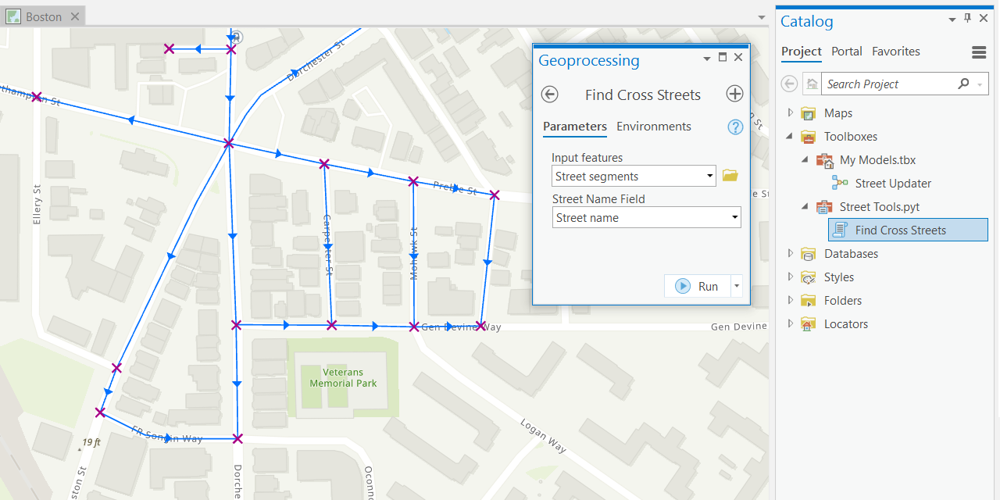
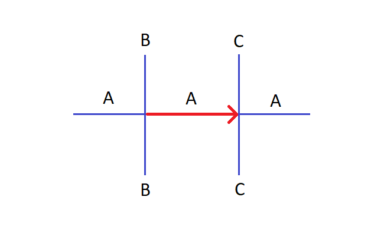
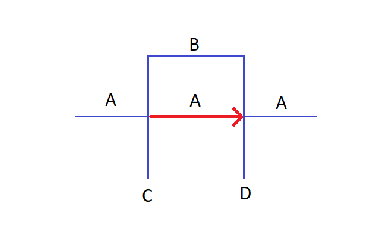
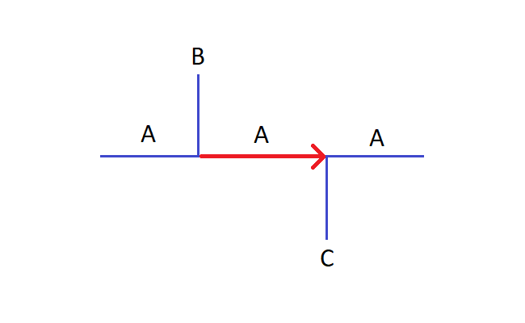
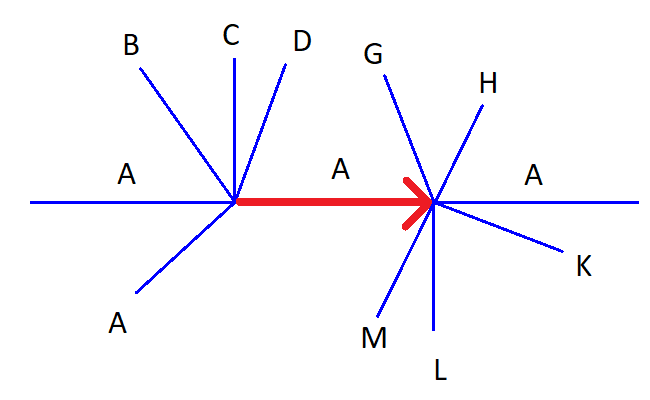

## Cross Streets Finder for ArcGIS Pro

ArcGIS Pro Python toolbox that finds the cross streets for a given street segment.

### Case 1

Result:

| Cross streets | Start | End |
|:--------------|:-----:|:---:|
| Left          |   B   |  C  |
| Right         |   B   |  C  |

### Case 2

Result:

| Cross streets | Start | End |
|:--------------|:-----:|:---:|
| Left          |   B   |  B  |
| Right         |   C   |  D  |

### Case 3

Result:

| Cross streets | Start | End  |
|:--------------|:-----:|:----:|
| Left          |   B   | None |
| Right         | None  |  C   |

### Case 4

Result:

| Cross streets | Start | End |
|:--------------|:-----:|:---:|
| Left          |   D   |  G  |
| Right         |   A   |  M  |

